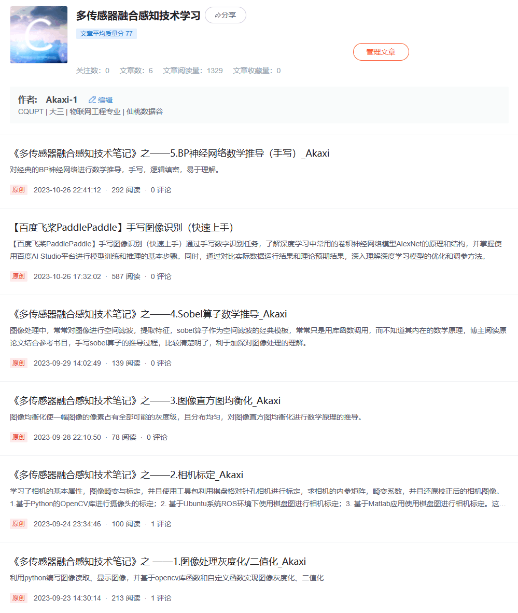

# 【多传感器融合感知技术】笔记

致谢：感谢岑老师的多传感器融合感知技术课程，受益良多。

文件目录：  
0.课件ppt  
1.图像灰度化  
2.相机标定  
3.直方图均衡化  
4.Sobel算子数学推导  
5.百度飞桨手写数字识别  
6.BP神经网络数学推导  
( 更新ing.... )
  
根据课程随笔专栏的博客：
https://blog.csdn.net/akaxi1/category_12450580.html?spm=1001.2014.3001.5482

  
  

